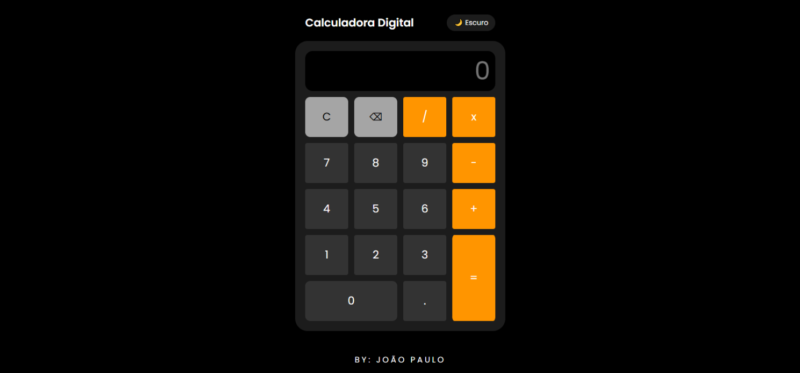
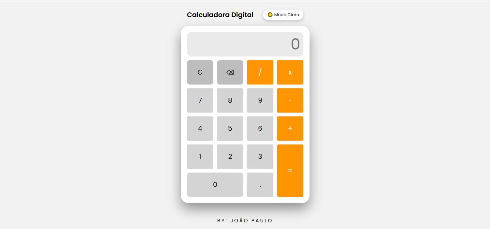

# 🧮 Calculadora Digital

Uma calculadora digital moderna inspirada no design do iPhone, desenvolvida com HTML, CSS e JavaScript puro.

## 🚀 Demonstração

Projeto responsivo com:
- ✅ Layout moderno
- ✅ Modo Claro / Escuro
- ✅ Transições suaves
- ✅ Grid Layout
- ✅ Design Mobile First

---

## 📸 Preview

Dark-mode

#

Light-mode

---

## 🛠️ Tecnologias Utilizadas

- HTML5
- CSS3
- JavaScript (ES6)
- CSS Grid
- Variáveis CSS
- Responsividade com Media Queries

---

## 🎨 Funcionalidades

- 🌓 Alternância entre Modo Claro e Escuro
- 📱 Layout totalmente responsivo
- 🎯 Botões com animação ao clicar
- 🧠 Estrutura organizada e limpa
- ⚡ Transições suaves entre temas

---

## 💡 Conceitos Aplicados

- Manipulação de DOM
- Eventos com `onclick`
- CSS Grid Layout
- `clamp()` para responsividade
- Variáveis CSS (`:root`)
- Alternância de classes com `classList.toggle()`

---

## 📱 Responsividade

O projeto foi desenvolvido com abordagem **mobile first**, garantindo:

- Boa experiência em celulares
- Ajuste automático em tablets
- Layout centralizado no desktop

---

<i>Se gostou, deixe uma ⭐ no repositório!</i>